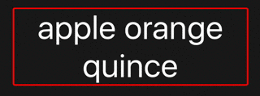

# FittableFontLabel

[](https://travis-ci.org/tbaranes/FittableFontLabel)

[](https://github.com/tbaranes/FittableFontLabel)
[](http://cocoadocs.org/docsets/FittableFontLabel)


`UILabel` can shrink font size as follows:

```swift
label.minimumScaleFactor = 0.3
label.adjustsFontSizeToFitWidth = true
label.numberOfLines = 1
```

But it won't always work as expected: 

- Doesn't fit the label height
- Big top / bottom margins when the maxFontSize is huge
- Not really customisable
- ...

That's why `FittableFontLabel` exists:

- Make the text fit the label size: width and height if multilines, width only if single lines
- Works with one or several lines
- Supports attributed string (custom line spacing...)
- Customize `maxFontSize` without using default label font size
- Auto-layout compliant
- `UILabel` extension if we want to use `UILabel`
- Customisable from xibs / storyboards when using the UILabel's subclass `FittableFontLabel`
- ...

**Multilines `UILabel`:**



**Multilines `UILabel` with attributed string (lines spacing):**


**Single line `UILabel`:**


## Usage

```swift
let aFittableFontLabel = FittableFontLabel(frame: CGRect(x: 0, y: 0, width: 300, height: 100))
aFittableFontLabel.autoFittableFont = true
aFittableFontLabel.lineBreakMode = .ByWordWrapping
aFittableFontLabel.numberOfLines = 0 // or 1...
aFittableFontLabel.text = "?"
// Change the text, it will always fit the label frame!
```

Check the sample project for advanced usage.

**Note:** The label `lineBreakMode` must be set to `NSLineBreakByWordWrapping` in order to work.

## Installation

- iOS 8.0+

### CocoaPods Installation

FittableFontLabel is available on CocoaPods. Just add the following to your Podfile:

```
pod 'FittableFontLabel'
```

### Swift Package Manager

FittableFontLabel is available on SPM. Just add the following to your Package file:

```swift
import PackageDescription

let package = Package(
    dependencies: [
        .Package(url: "https://github.com/tbaranes/FittableFontLabel.git", majorVersion: 1)
    ]
)
```

### Manual Installation

Just drag the `Source/*.swift` files into your project.


## UILabel extension

```swift
func fontSizeToFit(
		maxFontSize maxFontSize: CGFloat = CGFloat.NaN, 
		minFontScale: CGFloat = 0.1, 
		rectSize: CGSize? = nil)
```

Adjust the font size to make the current text fit the label frame.

- `maxFontSize`: the biggest font size to use during drawing. The default value is the current font size
- `minFontScale`: the scale factor that determines the smallest font size to use during drawing. The default value is 0.1
- `rectSize`: the size where the text must fit. The default value is the label bounds

## FittableFontLabel

An `UILabel` subclass allowing you to automatize the process of adjusting the font size.

```swift
@IBInspectable public var autoAdjustFontSize: Bool = true
```

If `true`, the font size will be adjusted each time that the `text` or the `frame` change.

```swift
@IBInspectable public var maxFontSize = CGFloat.NaN
```

The biggest font size to use during drawing. The default value is the current font size

```swift
@IBInspectable public var minFontScale = CGFloat.NaN
```

The scale factor that determines the smallest font size to use during drawing. The default value is 0.1

## What's next

- [ ] Binary search to improve the performance
- Your features!

## Contribution

- If you found a **bug**, open an **issue**
- If you have a **feature request**, open an **issue**
- If you want to **contribute**, submit a **pull request**

## Licence

`FittableFontLabel` is available under the MIT license. See the LICENSE file for more info.
